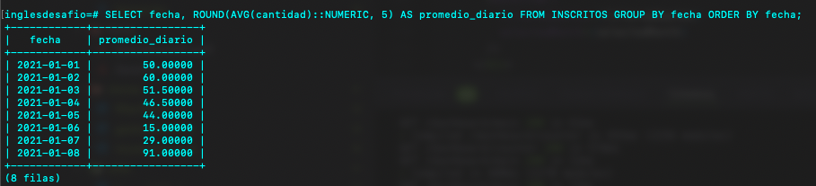

# Desafio 2 psql Manuel Cornejo

## Preguntas y Respuestas

### 1. ¿Cuántos registros hay?

```sql
SELECT COUNT(*) AS total_registros FROM INSCRITOS;

+-----------------+
| total_registros |
+-----------------+
|              16 |
+-----------------+
(1 fila)
```


### 2. ¿Cuántos inscritos hay en total?

```sql
SELECT SUM(cantidad) AS total_inscritos FROM INSCRITOS;

+-----------------+
| total_inscritos |
+-----------------+
|             774 |
+-----------------+
(1 fila)
```


### 3. ¿Cuál o cuáles son los registros de mayor antigüedad?

```sql
SELECT * FROM INSCRITOS WHERE fecha = (SELECT MIN(fecha) FROM INSCRITOS);

+----------+------------+--------+
| cantidad |   fecha    | fuente |
+----------+------------+--------+
|       44 | 2021-01-01 | Blog   |
|       56 | 2021-01-01 | Página |
+----------+------------+--------+
(2 filas)
```


### 4. ¿Cuántos inscritos hay por día?

```sql
SELECT fecha, SUM(cantidad) AS inscritos_por_dia FROM INSCRITOS GROUP BY fecha ORDER BY fecha;

+------------+-------------------+
|   fecha    | inscritos_por_dia |
+------------+-------------------+
| 2021-01-01 |               100 |
| 2021-01-02 |               120 |
| 2021-01-03 |               103 |
| 2021-01-04 |                93 |
| 2021-01-05 |                88 |
| 2021-01-06 |                30 |
| 2021-01-07 |                58 |
| 2021-01-08 |               182 |
+------------+-------------------+
(8 filas)
```


### 5. ¿Cuántos inscritos hay por fuente?

```sql
SELECT fuente, SUM(cantidad) AS inscritos_por_fuente FROM INSCRITOS GROUP BY fuente ORDER BY fuente;

+--------+----------------------+
| fuente | inscritos_por_fuente |
+--------+----------------------+
| Blog   |                  333 |
| Página |                  441 |
+--------+----------------------+
(2 filas)

```


### 6. ¿Qué día se inscribió la mayor cantidad de personas? ¿Cuántas personas se inscribieron en ese día?

```sql
SELECT fecha, SUM(cantidad) AS total_inscritos FROM INSCRITOS GROUP BY fecha ORDER BY total_inscritos DESC LIMIT 1;

+------------+-----------------+
|   fecha    | total_inscritos |
+------------+-----------------+
| 2021-01-08 |             182 |
+------------+-----------------+
(1 fila)
```


### 7. ¿Qué día se inscribieron la mayor cantidad de personas utilizando el blog? ¿Cuántas personas fueron?

```sql
SELECT fecha, cantidad AS inscritos_blog FROM INSCRITOS WHERE fuente = 'Blog' ORDER BY cantidad DESC, fecha ASC LIMIT 1;

+------------+----------------+
|   fecha    | inscritos_blog |
+------------+----------------+
| 2021-01-08 |             83 |
+------------+----------------+
(1 fila)

```


### 8. ¿Cuál es el promedio de personas inscritas por día?

```sql
SELECT fecha, ROUND(AVG(cantidad)::NUMERIC, 5) AS promedio_diario FROM INSCRITOS GROUP BY fecha ORDER BY fecha;

+------------+-----------------+
|   fecha    | promedio_diario |
+------------+-----------------+
| 2021-01-01 |        50.00000 |
| 2021-01-02 |        60.00000 |
| 2021-01-03 |        51.50000 |
| 2021-01-04 |        46.50000 |
| 2021-01-05 |        44.00000 |
| 2021-01-06 |        15.00000 |
| 2021-01-07 |        29.00000 |
| 2021-01-08 |        91.00000 |
+------------+-----------------+
(8 filas)

```



### 9. ¿Qué días se inscribieron más de 50 personas?

```sql
SELECT fecha, SUM(cantidad) AS total_inscritos FROM INSCRITOS GROUP BY fecha HAVING SUM(cantidad) > 50 ORDER BY fecha;

+------------+-----------------+
|   fecha    | total_inscritos |
+------------+-----------------+
| 2021-01-01 |             100 |
| 2021-01-02 |             120 |
| 2021-01-03 |             103 |
| 2021-01-04 |              93 |
| 2021-01-05 |              88 |
| 2021-01-07 |              58 |
| 2021-01-08 |             182 |
+------------+-----------------+
(7 filas)
```


### 10. ¿Cuál es el promedio por día de personas inscritas considerando desde el tercer día?

```sql
SELECT fecha, ROUND(AVG(cantidad)::NUMERIC, 5) AS promedio_diario FROM INSCRITOS WHERE fecha >= '2021-01-03' GROUP BY fecha ORDER BY fecha;

+------------+-----------------+
|   fecha    | promedio_diario |
+------------+-----------------+
| 2021-01-03 |        51.50000 |
| 2021-01-04 |        46.50000 |
| 2021-01-05 |        44.00000 |
| 2021-01-06 |        15.00000 |
| 2021-01-07 |        29.00000 |
| 2021-01-08 |        91.00000 |
+------------+-----------------+
(6 filas)
```


